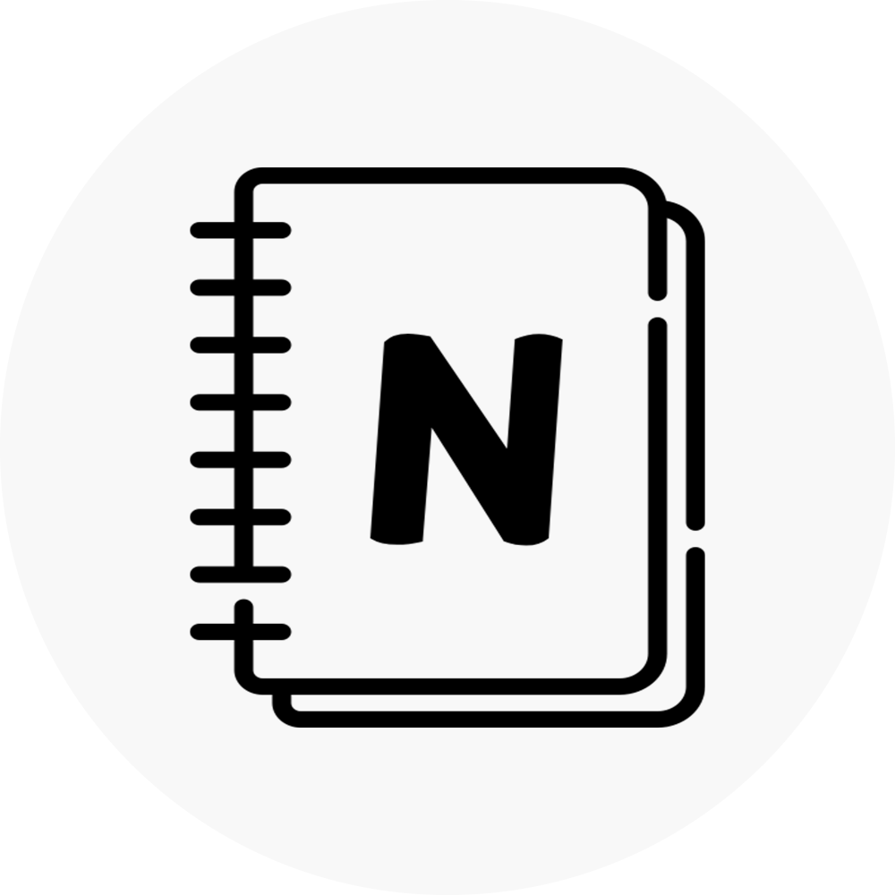

<h1 align="center">NotionPaper</h1>

  <i>NotionPaper is tool that helps you generate static sites from Notion, so that you can use Notion like a CMS.</i>
    
  
   
  <b><a href="https://prelude.cc/">Blog Usage Showcase</a></b> | <b><a href="https://docs.notionpaper.cc/post/6262938e-86d0-4214-af03-63078eb01ce3/">Getting Started</a></b> | <b><a href="https://docs.notionpaper.cc/">Documentation</a></b> | <b><a href="https://github.com/imyangmo/notionpaper">GitHub</a></b>
    

## Why NotionPaper
My initial thoughts are simple: I want a blogging platform that is simple and good to use enough, so that I could focus on writing instead of setting up a bulky environment. 

Notion is the perfect tool for that, however you need to pay some money on the subscription in order to let search engines to crawl your site. And I don't wanna spend money on that.

I've used many blogging platforms such as Hexo, Wordpress and etc., you can find my comparison among those platforms and why NotionPaper is a better choice on my blog.

Please take note: 
I am not a professional developer, this project was written as a hobby.
You are more than welcome to make this project better.

## How to use
Short version:
1. Clone this repo;
2. Install Node.js 16.16 and dependencies;
3. Apply for Notion API token;
4. Prepare the database;
5. Fill the token and database ID in the config file;
6. Run `npm run build`;
7. Deploy.

Full guide see [this](https://docs.notionpaper.cc/post/6262938e-86d0-4214-af03-63078eb01ce3/) doc.

## Supported Features / Roadmap
<table>
    <tr>
        <th>Category</th>
        <th>Features</th>
        <th>Support Status</th>
        <th>Remarks</th>
    </tr>

<tr>
    <td rowspan="3">Site</td>
    <td>Site name</td>
    <td>✅</td>
    <td>Uses database title as site name</td>
</tr>
    <tr>
        <td>Site description</td>
        <td>✅</td>
        <td>Uses database description as site description</td>
    </tr>
    <tr>
        <td>Site favicon</td>
        <td>✅</td>
        <td>Uses database icon as site icon</td>
    </tr>

<tr>
    <td rowspan="3">Page</td>
    <td>Page cover</td>
    <td>✅</td>
    <td>Uses page cover. ** Please noted **, external images will not be hosted for security reasons</td>
</tr>
    <tr>
        <td>Page favicon</td>
        <td>✅</td>
        <td></td>
    </tr>
    <tr>
        <td>Page Tags</td>
        <td>✍️ Up next</td>
        <td></td>
    </tr>

<tr>
    <td rowspan="22">Blocks</td>
    <td>Table of Contents</td>
    <td>✅</td>
    <td></td>
</tr>
    <tr>
        <td>Rich Texts</td>
        <td>✅</td>
        <td>Supports all anotations and text colors</td>
    </tr>
    <tr>
        <td>Divider</td>
        <td>✅</td>
        <td></td>
    </tr>
    <tr>
        <td>Paragraphs</td>
        <td>✅</td>
        <td></td>
    </tr>
    <tr>
        <td>Headings</td>
        <td>✅</td>
        <td></td>
    </tr>
    <tr>
        <td>Table</td>
        <td>✅</td>
        <td></td>
    </tr>
    <tr>
        <td>Images</td>
        <td>✅</td>
        <td>Supports uploads and externals. External images will not be hosted for security reasons</td>
    </tr>   
    <tr>
        <td>Videos</td>
        <td>✅</td>
        <td>Supports uploads, externals, and Youtube videos. External videos will not be hosted for security reasons</td>
    </tr> 
    <tr>
        <td>Code</td>
        <td>✅</td>
        <td></td>
    </tr> 
    <tr>
        <td>Bulleted and numbered lists</td>
        <td>✅</td>
        <td></td>
    </tr> 
    <tr>
        <td>Quote</td>
        <td>✅</td>
        <td></td>
    </tr> 
    <tr>
        <td>Callout</td>
        <td>✍️ Up next</td>
        <td></td>
    </tr> 
    <tr>
        <td>Child pages</td>
        <td>📅 Planned</td>
        <td></td>
    </tr> 
    <tr>
        <td>Embed</td>
        <td>📅 Planned</td>
        <td></td>
    </tr> 
    <tr>
        <td>Mention</td>
        <td>📅 Planned</td>
        <td>Including mentioned page and person</td>
    </tr> 
    <tr>
        <td>File</td>
        <td>📅 Planned</td>
        <td></td>
    </tr> 
    <tr>
        <td>PDF</td>
        <td>📅 Planned</td>
        <td></td>
    </tr> 
    <tr>
        <td>Bookmark</td>
        <td>📅 Planned</td>
        <td></td>
    </tr> 
    <tr>
        <td>Equation</td>
        <td>📅 Planned</td>
        <td></td>
    </tr> 
    <tr>
        <td>Breadcrumb</td>
        <td>📅 Planned</td>
        <td></td>
    </tr> 
    <tr>
        <td>Columns</td>
        <td>📅 Planned</td>
        <td></td>
    </tr> 
    <tr>
        <td>Nested blocks</td>
        <td>✅</td>
        <td>Children blocks</td>
    </tr> 
<tr>
    <td rowspan="3">Expandability</td>
    <td>Custom styles / Themes</td>
    <td>📅 Planned</td>
    <td>You could design and apply your own or others' theme</td>
</tr>
    <tr>
        <td>Custom pages</td>
        <td>📅 Planned</td>
        <td></td>
    </tr>
    <tr>
        <td>Search</td>
        <td>📅 Planned</td>
        <td></td>
    </tr>
</table>

## Update Notes

**2022.10.05**
 - ADD: nested blocks, font color support
 - FIX: fixed some bugs

Notes histories see [here](./UpdateNotes.md).